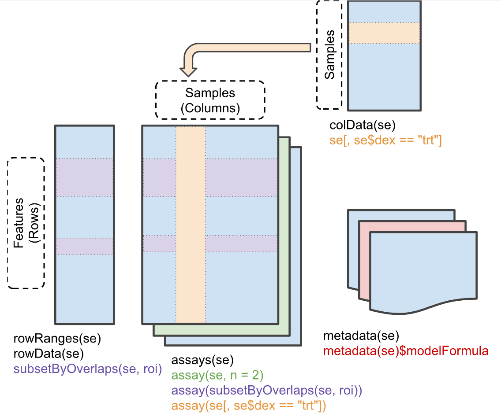

```{r setup, include=FALSE}
knitr::opts_chunk$set(echo = TRUE)
options(tinytex.verbose = TRUE)
```

En este trabajo se realizará un análsis exploratorio de un estudio metabolómico, escogido desde la base de datos **[Metabolomics Workbench](https://www.metabolomicsworkbench.org/)**. Por otro lado, usaremos la librería **[metabolomicsWorkbenchR](https://www.bioconductor.org/packages/release/bioc/html/metabolomicsWorkbenchR.html)** para extraer los datos directamente desde la web y **[SummarizedExperiment](https://www.bioconductor.org/packages/release/bioc/html/SummarizedExperiment.html)** para manejar los datos de manera estructurada. Ambas librerías se encuentran en el repositorio **[Bioconductor](https://www.bioconductor.org/install/)**. Para utilizar estas librerías, primero asegurarse de tener instalado Bioconductor y luego instalar metabolomicsWorkbenchR y SummarizedExperiment como indica en sus respectivos links.

En esta sección, importamos las librerías necesarias que utilizaremos a lo largo de este trabajo
```{r message=FALSE, warning=FALSE}
library(metabolomicsWorkbenchR)
library(SummarizedExperiment)
library(knitr)
library(dplyr)
library(tidyr)
library(ggplot2)
```

La librería **metabolomicsWorkbenchR** permite realizar consultas a directamente a su página web. Aquí se utiliza la función do_query para solicitar información de estudios, precisamente con la palabra Bacterial.
```{r}
estudios = do_query(
    context = 'study',
    input_item = 'study_title',
    input_value = 'Bacterial',
    output_item = 'summary'
)

```

El resultado fue almacenado en la variable estudios, la cual se puede visualizar como una tabla. Aquí se muestran los primeros 10 resultados de la consulta.

```{r}
kable(head(estudios))
```


Teniendo estas alternativas de interés, se decidio seleccionar el estudio ST003521. La justificación de este estudio es mi relación al estudio de microbiología y genes de resistencia. Además, este estudio pudo ser obtenido por los métodos que aquí se muestran y asociarlo con una publicación para mayor información (Se pobraron otros estudios con la misma metodología y varios fallaban). Para mayor información, se puede visitar directamente el estudio **[ST003521](https://www.metabolomicsworkbench.org/data/DRCCMetadata.php?Mode=Study&StudyID=ST003521&StudyType=MS&ResultType=1)** en su página web.

A continuación se procede a obtener los datos del estudio. Primero se obtendrá el summary del estudio. En la función do_query, se especifíca el estudio que al que se quiere acceder, mientras que en output_item se indica "summary"


## Summary de estudio seleccionado
```{r echo=TRUE}
summary <- do_query(
    context = "study",
    input_item = "study_id",
    input_value = "ST003521",
    output_item = "summary"
)

```

Dentro de los campos disponibles en summary se encuentran: "study_id", "study_title", "species", "institute", "analysis_type", "number_of_samples", "study_type"        "department", "last_name", "first_name", "email", "phone", "submit_date", "study_summary", "subject_species". En este caso en particular, solo están disponible los siguientes campos.

```{r echo=TRUE}

cat("ID de estudio: ", summary$study_id,"\n")
cat("Nombre de estudio: ", summary$study_title,"\n")
cat("Especies de estudio: ", summary$species,"\n")
cat("Instituto del estudio: ", summary$institute,"\n")
cat("Tipo de análisis: ", summary$analysis_type,"\n")
cat("Número de muestras: ", summary$number_of_samples,"\n")

```
A continuación se obtienen los datos del estudio. Para ello se indica su ID, y en output_item se indicará salida de tipo "SummarizedExperiment". De esta manera, los datos se obtendrán en formato del objeto **[SummarizedExperiment](https://www.bioconductor.org/packages/devel/bioc/vignettes/SummarizedExperiment/inst/doc/SummarizedExperiment.html)**, el cuál permite contener mucha información del estudio de manera estructurada dentro del mismo objeto.

En este caso, al obtener los datos, se obtiene una lista con 2 elementos SummarizedExperiment.Estos se almacenarán en variable llamada se_list


## Carga de Datos en clase SummarizedExperiment
```{r echo=TRUE}
se_list = do_query(
    context = 'study',
    input_item = 'study_id',
    input_value = 'ST003521',
    output_item = 'SummarizedExperiment'
)

```

```{r echo=TRUE}
n=1
for (se in se_list) 
{cat('Clase de elemento', n ,' : ',class(se), '\n')
n = n+1}
```

Exploraremos cada una de las matrices que contiene el objeto SummarizedExperiment. A continuación, una imagen representativa obtenida directamente desde la **[documentación de la librería](https://www.bioconductor.org/packages/devel/bioc/vignettes/SummarizedExperiment/inst/doc/SummarizedExperiment.html)**. 

{width=width height=height}


Observaremos la matriz 'assay'. Lo haremos con el primer elemento de los datos, pero se pueden realizar las mismas acciones con ambos. Para ello utilizamos la funcion assay() y usamos head para visualizar los primeros resultados.
Observamos también las dimensiones del dataset, donde obtenemos que este objeto consta de 513 filas y 58 columnas.


```{r echo=TRUE}

se1 <- se_list$AN005782
se2 <- se_list$AN005783

kable(head(assay(se1)))
cat('Dimensiones:\n Filas: ',dim(assay(se1))[1], '\n', 'Columnas: ', dim(assay(se1))[2])
```


Ahora observaremos específicamente la matriz de Features ( o Rows). Accedemos a ellas mediante la función rowData(). Al igual que antes, solo se mostrarán los primeros resultados para evitar extender demasiado el documento.

Aquó observamos que las dimensiones de esta matriz es de 513 filas y 3 columnas. Aquí se muestran los valores de metabolitos denotados con ids pero también con su nombre químico. Las columnas que se encuentran son: "metabolite_name", "metabolite_id" y "refmet_name"


```{r echo=TRUE}
kable(head(rowData(se1)))
cat('Dimensiones:\n Filas: ',dim(rowData(se1))[1], '\n', 'Columnas: ', dim(rowData(se1))[2])
```

Ahora revisamos la matriz Samples. Para ello accedemos con la función colData(). En este caso, las dimensiones son 58 filas y 7 columnas. Notar que ahora las filas corresponden a las columnas de la matriz assay. Las columnas de esta matriz corresponden a: "local_sample_id", "study_id",	"sample_source",	"mb_sample_id",	"raw_data",	"Sample_source",	"raw_file_name".

Los nombres que se observan en assay corresponden a local_sample_id. Se asume que el último sufijo "_N" corresponde al número de replicado de la muestra.
En sample_source se muestra el nombre más descriptivo de la muestra.  En mb_sample_id se tienen códigos de especies bacterianas. Todas corresponden a Acinetobacter baumannii ATCC 19606.


```{r echo=TRUE}
kable(head(colData(se1)))
cat('Dimensiones:\n Filas: ',dim(colData(se1))[1], '\n', 'Columnas: ', dim(colData(se1))[2])
```

Por último, exploramos la metadata del estudio. Para ello usamos la función metadata(). Esto nos entrega una lista con información.


```{r echo=TRUE}
metadata(se1)
```

#####


```{r}
library(SummarizedExperiment)

# Assuming your first SummarizedExperiment object is called 'se1'
average_replicates <- function(se) {
  # Get the assay data
  assay_data <- assay(se)
  col_names <- colnames(assay_data)
  
  # Identify replicate groups by removing "_N" suffix
  base_groups <- sub("_\\d+$", "", col_names)
  unique_groups <- unique(base_groups)
  
  # Initialize matrix for averaged data
  averaged_data <- matrix(nrow = nrow(assay_data), ncol = length(unique_groups))
  rownames(averaged_data) <- rownames(assay_data)
  colnames(averaged_data) <- unique_groups
  
  # Calculate averages for each group
  for (group in unique_groups) {
    group_cols <- which(base_groups == group)
    if (length(group_cols) > 1) {
      averaged_data[, group] <- rowMeans(assay_data[, group_cols, drop = FALSE], na.rm = TRUE)
    } else {
      averaged_data[, group] <- assay_data[, group_cols]
    }
  }
  
  # Create a new SummarizedExperiment with the averaged data
  new_se <- SummarizedExperiment(
    assays = list(averaged = averaged_data),
    colData = DataFrame(sample = unique_groups),
    rowData = rowData(se)
  )
  
  return(new_se)
}

se1 <- se_list$AN005782

# Apply to your first SummarizedExperiment object
se1_averaged <- average_replicates(se1)

# Verify the dimensions
dim(se1_averaged)
```


```{r}
library(SummarizedExperiment)
library(dplyr)
library(stringr)

# Supongamos que `se_list` es la lista que contiene los objetos SummarizedExperiment
se1 <- se_list[[1]]  # Tomamos el primer objeto

# Extraer la matriz de datos
data_matrix <- assay(se1)

# Obtener los nombres de las columnas
column_names <- colnames(data_matrix)

# Identificar los nombres base de los replicados (sin el "_N")
base_names <- unique(gsub("_\\d+$", "", column_names))

# Crear un dataframe vacío para almacenar los datos promediados
averaged_data <- data.frame(matrix(nrow = nrow(data_matrix)))

# Iterar sobre los nombres base y calcular el promedio de los replicados
for (name in base_names) {
  # Filtrar las columnas correspondientes al replicado
  matching_cols <- column_names[grepl(paste0("^", name, "_\\d+$"), column_names)]
  
  # Calcular el promedio de los replicados para cada fila
  averaged_data[, name] <- apply(data_matrix[, ..matching_cols, drop = FALSE], 1, mean, na.rm = TRUE)
}

# Asegurarse de que la primera columna (si no tiene replicados) se mantenga igual
#averaged_data[, 1] <- data_matrix[, 1]
names(averaged_data)[1] <- names(data_matrix)[1]

averaged_data_fix <- select(averaged_data, -Blank_1)

```

```{r}
# Suponiendo que `se` es el objeto SummarizedExperiment
se1 <- se_list$AN005782
data <- as.data.frame(assay(se1))
#data <-  averaged_data_fix

# Seleccionar columnas que terminan en '_6h'
cols_6h <- grep("_6h$", colnames(data), value = TRUE)
data_6h <- data %>% select(all_of(cols_6h))

# Obtener información de las condiciones experimentales
metadata <- colData(se1) %>% as.data.frame()
metadata_6h <- metadata %>% filter(grepl("_6h$", rownames(metadata)))

# Agregar información de condición a los datos
data_6h_tidy <- data_6h %>% 
  mutate(metabolite = rownames(.)) %>% 
  pivot_longer(cols = -metabolite, names_to = "sample", values_to = "value") %>% 
  left_join(metadata_6h, by = c("sample" = "rownames(metadata)"))

# Estadísticas descriptivas
summary_stats <- data_6h_tidy %>% 
  group_by(metabolite, condition) %>% 
  summarise(mean = mean(value, na.rm = TRUE), 
            sd = sd(value, na.rm = TRUE), 
            .groups = "drop")

# Comparación entre condiciones
if (length(unique(metadata_6h$condition)) > 1) {
  comparison_results <- data_6h_tidy %>% 
    group_by(metabolite) %>% 
    summarise(p_value = t.test(value ~ condition, data = .)$p.value, .groups = "drop") %>% 
    mutate(adj_p_value = p.adjust(p_value, method = "BH"))
} else {
  comparison_results <- data.frame(metabolite = unique(data_6h_tidy$metabolite), 
                                   p_value = NA, adj_p_value = NA)
}

# Guardar resultados
write.csv(summary_stats, "summary_stats_6h.csv", row.names = FALSE)
write.csv(comparison_results, "comparison_results_6h.csv", row.names = FALSE)

# Visualización de algunos metabolitos seleccionados
ggplot(data_6h_tidy, aes(x = condition, y = value, fill = condition)) +
  geom_boxplot() +
  facet_wrap(~ metabolite, scales = "free") +
  theme_minimal() +
  labs(title = "Comparación de niveles de metabolitos a las 6 horas")
```


